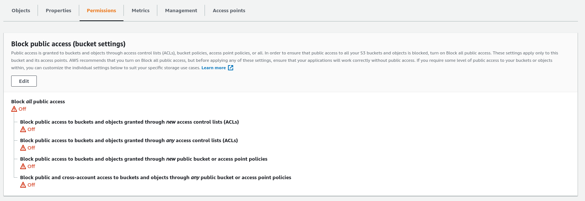

# AWS S3 Demo with PERN Stack

[Live Version](https://aws-s3-pern-demo.herokuapp.com)

- Postgres
- Express
- React
- Node

## Set Up

#### Packages to install in your backend

- [multer](https://www.npmjs.com/package/multer)
- [aws-sdk](https://www.npmjs.com/package/aws-sdk)
- [body-parser](https://www.npmjs.com/package/body-parser)

#### Create your AWS User and Bucket

Navigate to [https://s3.console.aws.amazon.com/s3/home?region=us-east-1](https://s3.console.aws.amazon.com/s3/home?region=us-east-1) click on “create bucket”, enter a name, choose a region, and leave all other options as default.

Head to [https://console.aws.amazon.com/iam/home?#/users](https://console.aws.amazon.com/iam/home?#/users) to create a new user. Name the user whatever you like. Give the user `Programmatic access`. Proceed to the next step. Now you need to set up the security policy for your new user. This is how they will be allowed to connect. Click 'Attach existing policies directly' and then 'Create Policy'. This will open up a new tab.

In the new tab, click the `JSON` tab and paste the following:

```json
{
  "Version": "2012-10-17",
  "Statement": [
    {
      "Sid": "Stmt1420751757000",
      "Effect": "Allow",
      "Action": ["s3:*"],
      "Resource": "arn:aws:s3:::<NAME OF BUCKET>/*"
    }
  ]
}
```

Make sure to replace `<NAME OF BUCKET>` with the name of your bucket. Click Review Policy.

Give the policy whatever name you like (e.g. s3-access-to-name-of-project). After you save and create the policy, head back over to the other tab/window where you are creating a new user.

Click the refresh button all the way to the right of the `Create Policy` button then search for the policy that you just created. Check that policy then head over to the next step. You can skip additional tags. Create the user.

After you create the user, you will get the `Access Key ID` and the `Secret Access Key`. Download the .csv file **Store this somewhere safe on your computer**

## Update app.js in backend

In your app.js import the body-parser you module you installed in your backend node_modules.

```javascript
const bodyParser = require("body-parser");
```

Change the line of code that says `app.use(express.json())` to the following:

```javascript
app.use(bodyParser.urlencoded({ extended: false }));
app.use(bodyParser.json());
```

You can learn more about the body parser module here: [body-parser](https://www.npmjs.com/package/body-parser)

## Set up AWS S3 in your backend

### [`awsS3.js`](https://github.com/jamesurobertson/aws-s3-pern-demo/blob/master/backend/awsS3.js)

Make a file called `awsS3.js` at the root of your backend directory. [Link to file](https://github.com/jamesurobertson/aws-s3-pern-demo/blob/master/backend/awsS3.js)
Copy the contents of [this file](https://github.com/jamesurobertson/aws-s3-pern-demo/blob/master/backend/awsS3.js) into the file you just created.

**Rename the `NAME_OF_BUCKET` constant at the top of the `awsS3.js` file to match the name of your bucket.**

In there, you will see that you are using the package, `aws-sdk`, after setting up your credentials for aws, be sure to add them to your `.env` file

```
AWS_ACCESS_KEY_ID=<Your access key here>
AWS_SECRET_ACCESS_KEY=<Your secret access key here>
```

#### How to set up your credentials

All you need to do is set environmental keys for `AWS_ACCESS_KEY_ID` and `AWS_SECRET_ACCESS_KEY`. Aws will then automatically use those environment variables. When you deploy to heroku, you will also need to set these environment variables there as well.

> You can read more about how AWS uses the environment variables here:
> [https://docs.aws.amazon.com/sdk-for-javascript/v2/developer-guide/loading-node-credentials-environment.html](https://docs.aws.amazon.com/sdk-for-javascript/v2/developer-guide/loading-node-credentials-environment.html)

**MAKE SURE TO GITIGNORE YOUR .ENV FILE**

## Private vs Public File Uploading

If you absolutely don't want your file images to be publicly available by just any user, you want your files to be private. If you don't care if users are able to access those files (e.g. on Twitter, posts are public so any photos with those posts can be publicly viewed), then you can set up the files to be publicly read.

Public upload is recommended for most of the uses cases for your portfolio projects.

### Public Files

How to set up uploading and reading public files on the backend.

#### Public File Write Configuration

Take a look at the function `singlePublicFileUpload` in the your `awsS3.js`. It accepts a single file which to upload to AWS S3.

```javascript
const singlePublicFileUpload = async (file) => {
  const { originalname, mimetype, buffer } = await file;
  const path = require("path");
  // name of the file in your S3 bucket will be the date in ms plus the extension name
  const Key = new Date().getTime().toString() + path.extname(originalname);
  const uploadParams = {
    Bucket: NAME_OF_BUCKET,
    Key,
    Body: buffer,
    ACL: "public-read",
  };
  const result = await s3.upload(uploadParams).promise();

  // save the name of the file in your bucket as the key in your database to retrieve for later
  return result.Location;
};
```

You will generate a key on S3 that you can use to identify the file that you will be uploading by using a timestamp which guarantees that they key will always be unique.

`const Key = new Date().getTime().toString() + path.extname(originalname);`

The upload parameters to S3 include a key-value pair, `ACL: "public-read"`. This tells the bucket that this file can be publicly read by anyone who has the link to the file.

S3 sends back data on the saved file which is saved to the variable `result`.

`const result = await s3.upload(uploadParams).promise();`

You will be saving this url link that S3 generates for us to your database which can be extracted from `result.Location`

Now all you need is the file to pass into the `singlePublicFileUpload` function. In this walkthrough you are going to be importing it to one of your routes - [Users Routes](https://github.com/jamesurobertson/aws-s3-pern-demo/blob/master/backend/routes/api/users.js). But you can use the same logic in any route you'd like.

In this file, you need to import the `singlePublicFileUpload` function as well as the `singleMulterUpload` middleware from the `awsS3.js` file.

```javascript
// Post /api/users ---Sign up
router.post(
  "/",
  singleMulterUpload("image"),
  validateSignup,
  asyncHandler(async (req, res) => {
    const { email, password, username } = req.body;
    const profileImageUrl = await singlePublicFileUpload(req.file);
    const user = await User.signup({
      username,
      email,
      password,
      profileImageUrl,
    });

    setTokenCookie(res, user);

    return res.json({
      user,
    });
  })
);
```

```javascript
// in awsS3.js
const storage = multer.memoryStorage({
  destination: function (req, file, callback) {
    callback(null, "");
  },
});

// in awsS3.js
const singleMulterUpload = (nameOfKey) =>
  multer({ storage: storage }).single(nameOfKey);
```

`singleMulterUpload` is a function that generates the middleware necessary to convert the data from your form into readable fields and files. This function accepts the key to which you expect the files to be saved under in your data (`"image"` in this case).

Connect the `singleMulterUpload` middleware to your `POST /api/users` route, and then you can access the file in your request under the key of file - `req.file`

Because the `singlePublicFileUpload` is an async function, it returns a promise. That promise returns the file URL that you want to save to your database. In this case, you want to save that url under the key of `profileImageUrl` on the new User.

#### Public File Read Configuration

**On AWS S3 Console**

Access your bucket public permissions:


Unblock all public access. Your images are going to be accessible to the public for this demo. Be careful when setting this for more sensitive information in the future where you do want to block public access.

Hit Save

**Sending up the files to your frontend**

All you need to read the files on your frontend is the url path to the file that you saved to the database. Nothing special is needed other than the saved S3 URL.

### Multiple Files Backend

Take a look at the `multiplePublicFileUpload`, and `multipleMulterUpload` functions in the following file, [`awsS3.js`](https://github.com/jamesurobertson/aws-s3-pern-demo/blob/master/backend/awsS3.js). These functions are used in the same way as the single file upload functions above.

## File Upload on the Frontend

You will be using fetch for this example. To send files, the Content-Type Header must be `"multipart/form-data"`. In your custom fetch function, `csrfFetch`, in the csrf.js file you have these lines of code:

```javascript
options.headers["Content-Type"] =
  options.headers["Content-Type"] || "application/json";
```

By adding formData to the body of your request, the browser will automatically set the appropriate headers and boundaries so you need to remove the `Content-Type` header if it is multipart/form-data.

The entire if statement should now look like this:

```javascript
if (options.method.toUpperCase() !== "GET") {
  if (options.headers["Content-Type"] === "multipart/form-data") {
    delete options.headers["Content-Type"];
  } else {
    options.headers["Content-Type"] =
      options.headers["Content-Type"] || "application/json";
  }
  options.headers["XSRF-Token"] = Cookies.get("XSRF-TOKEN");
}
```

In the [`session.js`](https://github.com/jamesurobertson/aws-s3-pern-demo/blob/master/frontend/src/store/session.js) file, you will be defining your `createUser` thunk which accepts an object of key value pairs and turns them into `FormData` entries to send with your request.

```javascript
// user_actions.js
const SET_USER = "session/setUser";

const setUser = (user) => ({
  type: SET_USER,
  payload: user,
});

export const createUser = (user) => async (dispatch) => {
  const { images, image, username, email, password } = user;
  const formData = new FormData();
  formData.append("username", username);
  formData.append("email", email);
  formData.append("password", password);

  // for multiple files
  if (images && images.length !== 0) {
    for (var i = 0; i < images.length; i++) {
      formData.append("images", images[i]);
    }
  }

  // for single file
  if (image) formData.append("image", image);

  const res = await csrfFetch(`/api/users/`, {
    method: "POST",
    headers: {
      "Content-Type": "multipart/form-data",
    },
    body: formData,
  });

  const data = await res.json();
  dispatch(setUser(data.user));
};
```

You can now add a new case to your reducer

```javascript
switch (action.type) {
    case SET_USER:
      return { ...state, user: action.payload };
```

The form itself should look just like a regular React form. Take a look at this form for an example: [CreateUser](https://github.com/jamesurobertson/aws-s3-pern-demo/blob/master/frontend/src/pages/CreateUser.js)

```javascript
// CreateUser.js file
import { useState } from "react";
import { createUser } from "../store/session";
import { useDispatch, useSelector } from "react-redux";

const CreateUser = () => {
  const [username, setUsername] = useState("");
  const [email, setEmail] = useState("");
  const [password, setPassword] = useState("");
  const [image, setImage] = useState(null);
  // for multuple file upload
  //   const [images, setImages] = useState([]);
  const [errors, setErrors] = useState([]);

  const dispatch = useDispatch();
  const user = useSelector((state) => state.session.user);

  const handleSubmit = (e) => {
    e.preventDefault();
    let newErrors = [];
    dispatch(createUser({ username, email, password, image }))
      .then(() => {
        setUsername("");
        setEmail("");
        setPassword("");
        setImage(null);
      })
      .catch(async (res) => {
        const data = await res.json();
        if (data && data.errors) {
          newErrors = data.errors;
          setErrors(newErrors);
        }
      });
  };

  const updateFile = (e) => {
    const file = e.target.files[0];
    if (file) setImage(file);
  };

  // for multiple file upload
  //   const updateFiles = (e) => {
  //     const files = e.target.files;
  //     setImages(files);
  //   };

  return (
    <div>
      <h1>AWS S3 Express-React Demo</h1>
      {errors.length > 0 &&
        errors.map((error) => <div key={error}>{error}</div>)}
      <form
        style={{ display: "flex", flexFlow: "column" }}
        onSubmit={handleSubmit}
      >
        <label>
          <input
            type="text"
            placeholder="Username"
            value={username}
            onChange={(e) => setUsername(e.target.value)}
          />
        </label>
        <label>
          <input
            type="email"
            placeholder="Email"
            value={email}
            onChange={(e) => setEmail(e.target.value)}
          />
        </label>
        <label>
          <input
            type="password"
            placeholder="Password"
            value={password}
            onChange={(e) => setPassword(e.target.value)}
          />
        </label>
        <label>
          <input type="file" onChange={updateFile} />
        </label>
        {/* <label>
            Multiple Upload
            <input 
              type="file"
              multiple
              onChange={updateFiles} />
          </label> */}
        <button type="submit">Create User</button>
      </form>
      <div>
        {user && (
          <div>
            <h1>{user.username}</h1>
            
          </div>
        )}
      </div>
    </div>
  );
};

export default CreateUser;
```

If you have any questions or get stuck on any part of the process, please feel free to message me!
