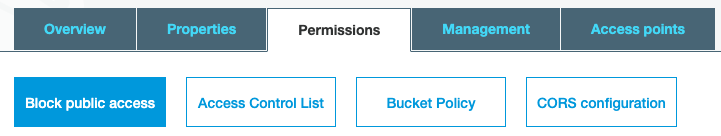

# AWS S3 Demo with MERN

[Live Version](https://aws-s3-mern-demo.herokuapp.com/#/)

## Set Up

#### Packages to install in your backend

- [multer](https://www.npmjs.com/package/multer)
- [aws-sdk](https://www.npmjs.com/package/aws-sdk)
- [body-parser](https://www.npmjs.com/package/body-parser)

#### Create your AWS User and Bucket

Navigate to [https://s3.console.aws.amazon.com/s3/home?region=us-east-1](https://s3.console.aws.amazon.com/s3/home?region=us-east-1) click on “create bucket”, enter a name, choose a region, and leave all other options as default.

Head to [https://console.aws.amazon.com/iam/home?#/users](https://console.aws.amazon.com/iam/home?#/users) to create a new user. Name the user whatever you like. Give the user `Programmatic access`. Proceed to the next step. Now we need to set up the security policy for our new user. This is how they will be allowed to connect. Click 'Attach existing policies directly' and then 'Create Policy'. This will open up a new tab.

In the new tab, click the `JSON` tab and paste the following:

```json
{
  "Version": "2012-10-17",
  "Statement": [
    {
      "Sid": "Stmt1420751757000",
      "Effect": "Allow",
      "Action": ["s3:*"],
      "Resource": "arn:aws:s3:::<NAME OF BUCKET>/*"
    }
  ]
}
```

Make sure to replace `<NAME OF BUCKET>` with the name of your bucket. Click Review Policy.

Give the policy whatever name you like (e.g. s3-access-to-name-of-project). After you save and create the policy, head back over to the other tab/window where you are creating a new user.

Click the refresh button all the way to the right of the `Create Policy` button then search for the policy that you just created. Check that policy then head over to the next step. You can skip additional tags. Create the user.

After you create the user, you will get the `Access Key ID` and the `Secret Access Key`. Download the .csv file **Store this somewhere safe on your computer**

## Set up AWS S3 in your backend

### [`awsS3.js`](https://github.com/ssoonmi/aws-s3-MERN-demo/blob/master/awsS3.js)

Make a file called `awsS3.js` at the root of your backend directory. [Link to file](https://github.com/ssoonmi/aws-s3-MERN-demo/blob/master/awsS3.js)
Copy the contents of [this file](https://github.com/ssoonmi/aws-s3-MERN-demo/blob/master/awsS3.js) into the file you just created.

**Rename the `NAME_OF_BUCKET` constant at the top of the `awsS3.js` file.**

In there, you will see that we use the package, `aws-sdk`, set up your credentials for aws, and then export it.

```javascript
const AWS = require("aws-sdk");
if (process.env.NODE_ENV !== "production") {
  AWS.config.loadFromPath("./credentials.json");
}
const s3 = new AWS.S3({ apiVersion: "2006-03-01" });

module.exports = { s3 };
```

#### `AWS.config.loadFromPath`

This function is allowing us to configure our aws keys using a json file.

> You can learn more about how this works here:
> [https://docs.aws.amazon.com/sdk-for-javascript/v2/developer-guide/loading-node-credentials-json-file.html](https://docs.aws.amazon.com/sdk-for-javascript/v2/developer-guide/loading-node-credentials-json-file.html)

#### How to set up your credentials in production

You do not need a credentials.json in production. Instead, all you need to do is set environmental keys for `AWS_ACCESS_KEY_ID` and `AWS_SECRET_ACCESS_KEY`.

> You can read more about how AWS uses the environment variables here:
> [https://docs.aws.amazon.com/sdk-for-javascript/v2/developer-guide/loading-node-credentials-environment.html](https://docs.aws.amazon.com/sdk-for-javascript/v2/developer-guide/loading-node-credentials-environment.html)

### `credentials.json`

Make a file called `credentials.json` **at the root** of your project.
In there, you will set your aws credentials that you got when you created the AWS User.

```json
{
  "accessKeyId": "<Your AWS Access Key ID>",
  "secretAccessKey": "<Your AWS Secret Access Key>",
  "region": "us-east-1"
}
```

**MAKE SURE TO GITIGNORE THIS FILE**

## Private vs Public File Uploading

If you absolutely don't want your file images to be publicly available by just any user, you want your files to be private. If you don't care if users are able to access those files (e.g. on Twitter, posts are public so any photos with those posts can be publicly viewed), then you can set up the files to be publicly read.

Take a look at the following file, [`awsS3.js`](https://github.com/ssoonmi/aws-s3-MERN-demo/blob/master/awsS3.js), to see how to set up private vs. public AWS S3 upload.

### Public Files

How to set up uploading and reading public files on the backend.

#### Public File Write Configuration

Take a look at the function `singlePublicFileUpload` in the following file, [`awsS3.js`](https://github.com/ssoonmi/aws-s3-MERN-demo/blob/master/awsS3.js). It accepts a single file which to upload to AWS S3.

```javascript
const singlePublicFileUpload = async (file) => {
  const { originalname, mimetype, buffer } = await file;
  const path = require("path");
  // name of the file in your S3 bucket will be the date in ms plus the extension name
  const Key = new Date().getTime().toString() + path.extname(originalname);
  const uploadParams = {
    Bucket: NAME_OF_BUCKET,
    Key,
    Body: buffer,
    ACL: "public-read",
  };
  const result = await s3.upload(uploadParams).promise();

  // save the name of the file in your bucket as the key in your database to retrieve for later
  return result.Location;
};
```

We will generate a key on S3 that we can use to identify the file that we will be uploading by using a timestamp which guarantees that they key will always be unique.

`const Key = new Date().getTime().toString() + path.extname(originalname);`

The upload parameters to S3 include a key-value pair, `ACL: "public-read"`. This tells the bucket that this file can be publicly read by anyone who has the link to the file.

S3 sends back data on the saved file which is saved to the variable `result`.

`const result = await s3.upload(uploadParams).promise();`

We will be saving this url link that S3 generates for us to our database which can be extracted from `result.Location`

Now all we need is the file to pass into the `singlePublicFileUpload` function. In this walkthrough we are going to be importing it to one of our routes [Users Routes](https://github.com/ssoonmi/aws-s3-MERN-demo/blob/master/routes/api/users.js). //TODO change path

In this file, we need to import the `singlePublicFileUpload` function as well as the `singleMulterUpload` middleware from the `awsS3.js` file.

```javascript
// Post /api/users ---Sign up
router.post(
  "/",
  singleMulterUpload("image"),
  validateSignup,
  asyncHandler(async (req, res) => {
    const { email, password, username } = req.body;
    const profileImageUrl = await singlePublicFileUpload(req.file);
    const user = await User.signup({
      username,
      email,
      password,
      profileImageUrl,
    });

    setTokenCookie(res, user);

    return res.json({
      user,
    });
  })
);
```

```javascript
// in awsS3.js
const storage = multer.memoryStorage({
  destination: function (req, file, callback) {
    callback(null, "");
  },
});

const singleMulterUpload = (nameOfKey) =>
  multer({ storage: storage }).single(nameOfKey);
```

`singleMulterUpload` is a function that generates the middleware necessary to convert the data from our form into readable fields and files. This function accepts the key to which we expect the files to be saved under in our data (`"image"` in this case).

We connect the `singleMulterUpload` middleware to our `POST /api/users` route, and then we can access the file in our request, `req` under the key of `file`.

Because the `singlePublicFileUpload` is an async function, it returns a promise. That promise returns the file URL that we want to save to our database. In this case, I want to save that url under the key of `profileImageUrl` on the new User.

#### Public File Read Configuration

**On AWS S3 Console**

Access your bucket public permissions:


Unblock all public access. Our images are going to be accessible to the public. Be careful when setting this for more sensitive information in the future where you do want to block public access.

Hit Save

**Sending up the files to your frontend**

All you need to read the files on your frontend is the link to the file that you saved to the database. Nothing special is needed other than the saved S3 URL.

### Multiple Files Backend

Take a look at the `multiplePublicFileUpload`, and `multipleMulterUpload` functions in the following file, [`awsS3.js`](https://github.com/ssoonmi/aws-s3-MERN-demo/blob/master/awsS3.js). //TODO CHANGE FILE These functions are used in the same way as the single file upload functions above.

## File Upload on the Frontend

We will be using fetch for this example. To send files, the Content-Type Header must be `"multipart/form-data"`. In our custon fetch function in the csrf.js file we have these lines of code:

```javascript
options.headers["Content-Type"] =
  options.headers["Content-Type"] || "application/json";
```

For us to add the apporopriate boundaries to our multipart/form-data we need to comment out this line of code. By adding formdata to the body of our request, the browser will automatically set the appropriate headers and boundaries. By doing this we need to make sure we are adding the 'application/json' Content-Type header on our fetch requests that are sending along json.

//TODO: change file path
In the (`session.js`)[https://github.com/ssoonmi/aws-s3-MERN-demo/blob/master/frontend/src/actions/users_actions.js] file, we will be defining our `createUser` action which accepts an object of key value pairs and turns them into `FormData` entries to send with our request.

```javascript
// user_actions.js
const SET_USER = "session/setUser";

const setUser = (user) => ({
  type: SET_USER,
  payload: user,
});

export const createUser = (user) => async (dispatch) => {
  const { username, email, password, image } = user;
  const formData = new FormData();
  formData.append("username", username);
  formData.append("email", email);
  formData.append("password", password);

  // for single file
  if (image) formData.append("image", image);

  const res = await fetch(`/api/users/`, {
    method: "POST",
    body: formData,
  });

  console.log(res.data.user);
  dispatch(setUser(res.data.user));
};
```

We can now add a new case to our reducer

```javascript
switch (action.type) {
    case SET_USER:
      return { ...state, user: action.payload };
```

//TODO change
The form itself, should look just like a regular React form. Take a look at this form for an example: (UserForm)[https://github.com/ssoonmi/aws-s3-MERN-demo/blob/master/frontend/src/components/main/MainPage.js]

```javascript
// CreateUser.js file
import { useState, useEffect } from "react";
import { createUser } from "../store/session";
import { useDispatch, useSelector } from "react-redux";

const CreateUser = () => {
  const [username, setUsername] = useState("");
  const [email, setEmail] = useState("");
  const [password, setPassword] = useState("");
  const [image, setImage] = useState(null);

  const dispatch = useDispatch();
  const user = useSelector((state) => state.session.user);

  const handleSubmit = (e) => {
    e.preventDefault();
    dispatch(createUser({ username, email, password, image }));
    setUsername("");
    setEmail("");
    setPassword("");
    setImage(null);
  };

  const updateFile = (e) => {
    const file = e.target.files[0];
    if (file) setImage(file);
  };

  return (
    <div>
      <h1>AWS S3 Express-React Demo</h1>
      <form
        style={{ display: "flex", flexFlow: "column" }}
        onSubmit={handleSubmit}
      >
        <label>
          <input
            type="text"
            placeholder="Username"
            value={username}
            onChange={(e) => setUsername(e.target.value)}
          />
        </label>
        <label>
          <input
            type="email"
            placeholder="Email"
            value={email}
            onChange={(e) => setEmail(e.target.value)}
          />
        </label>
        <label>
          <input
            type="password"
            placeholder="Password"
            value={password}
            onChange={(e) => setPassword(e.target.value)}
          />
        </label>
        <label>
          <input type="file" onChange={updateFile} />
        </label>
        {/* <label>
            Multiple Upload
            <input 
              type="file"
              multiple
              onChange={updateFiles} />
          </label> */}
        <button type="submit" value="Create User">
          Create User
        </button>
      </form>
      <div>
        {/* Displays the current logged in user */}
        {user && (
          <div>
            <h1>{user.username}</h1>
            
          </div>
        )}
      </div>
    </div>
  );
};

export default CreateUser;
```

If you have any questions or get stuck on any part of the process, please feel free to message me.
